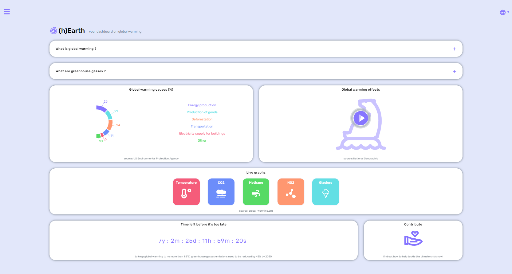

<p align="center">
  
  <h3 align="center">(h)Earth</h3>

  <p align="center">
    A simply dashboard to show global-warming data, built with React. </p>

  <br>
  <br>

  <a href="https://github.com/claudiovarzi/global-warming-app">
    
  </a>
</p>

<details open="open">
  <summary><h2 style="display: inline-block">Table of Contents</h2></summary>
  <ol>
    <li>
      <a href="#about-the-project">About The Project</a>
      <ul>
        <li><a href="#built-with">Built With</a></li>
      </ul>
    </li>
    <li>
      <a href="#getting-started">Getting Started</a>
      <ul>
        <li><a href="#prerequisites">Prerequisites</a></li>
        <li><a href="#installation">Installation</a></li>
      </ul>
    </li>
    <li><a href="#license">License</a></li>
    <li><a href="#links-contacts">Links & Contacts</a></li>
    <li><a href="#acknowledgements">Acknowledgements</a></li>
  </ol>
</details>

## About The Project

This is a simply dashboard made to sensitize the user on the global-warming topic: from its causes to its consequences, from its data to the individual actions we have to do in order to tackle the climate crisis before it's too late. Data are fetched from [global-warming APIs](https://global-warming.org/), other info are made of personal research.
User can explore seven main routes:

<ul>
<li>the <strong>Home page</strong>, which contains general info about global-warming and links to the other sections,</li>

<li>the <strong>Temperature section</strong>, which contains the global temperature anomalies from year 1880 to present, </li>

<li>the <strong>Co2 section</strong>, which contains the carbon dioxide levels in the atmosphere from 2012 to present, </li>

<li>the <strong>Methane section</strong>, which contains the methane levels in the atmosphere from 1983 to present, </li>

<li>the <strong>No2 section</strong>, which contains the nitrous oxide levels in the atmosphere from 2001 to present, </li>

<li>the <strong>Glaciers section</strong>, which contains the arctic sea extent and area since 1979, </li>

<li>the <strong>Contribute section</strong>, which contains ten individual actions that people should do individually to help tackle climate crisis, according to United Nations.</li>
</ul>

### Built With

- [React](https://it.reactjs.org/)
- [react-router-dom-v6](https://reactrouter.com/docs/en/v6/upgrading/v5)
- [CSS modules](https://github.com/css-modules/css-modules)
- [Axios](https://github.com/axios/axios)
- [Lodash](https://github.com/lodash/lodash)
- [recharts](https://github.com/recharts/recharts)
- [react-player](https://github.com/cookpete/react-player)
- [react-responsive](https://www.npmjs.com/package/react-responsive)
- [react-icons](https://react-icons.github.io/react-icons/)
- [animate.css](https://github.com/animate-css/animate.css)
- [react-onclickoutside](https://github.com/Pomax/react-onclickoutside)

## Getting Started

### Prerequisites

Running the application requires [Node](https://nodejs.org/en/) to be installed on your operating system.

You can then install the latest version of npm from your terminal with the command:

```sh
npm install npm@latest -g
```

### Installation

1. Clone the repository locally with the git command:

   ```sh
   git clone https://github.com/claudiovarzi/global-warming-app
   ```

2. Install NPM packages:

   ```sh
   npm install
   ```

3. Run the app with command:

   ```sh
   npm start
   ```

## License

Distributed under the MIT License. See `LICENSE` for more information.

## Links & Contacts

[@Claudio Varzi](https://www.linkedin.com/in/claudiovarzi/) - varziclaudio@gmail.com

Project Repository: [global-warming-app](https://github.com/claudiovarzi/global-warming-app)

Project Website: [(h)Earth - Netlify]()

## Acknowledgements

- [global-warming.org](https://global-warming.org/)
- [Best-README-Template](https://github.com/othneildrew/Best-README-Template)
- [Awesome README](https://github.com/matiassingers/awesome-readme)
- [React](https://it.reactjs.org/)
- [react-router-dom-v6](https://reactrouter.com/docs/en/v6/upgrading/v5)
- [CSS modules](https://github.com/css-modules/css-modules)
- [Axios](https://github.com/axios/axios)
- [Lodash](https://github.com/lodash/lodash)
- [recharts](https://github.com/recharts/recharts)
- [react-player](https://github.com/cookpete/react-player)
- [react-responsive](https://www.npmjs.com/package/react-responsive)
- [react-icons](https://react-icons.github.io/react-icons/)
- [animate.css](https://github.com/animate-css/animate.css)
- [react-onclickoutside](https://github.com/Pomax/react-onclickoutside)
